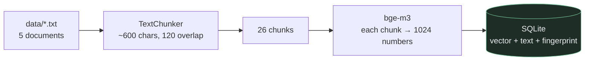
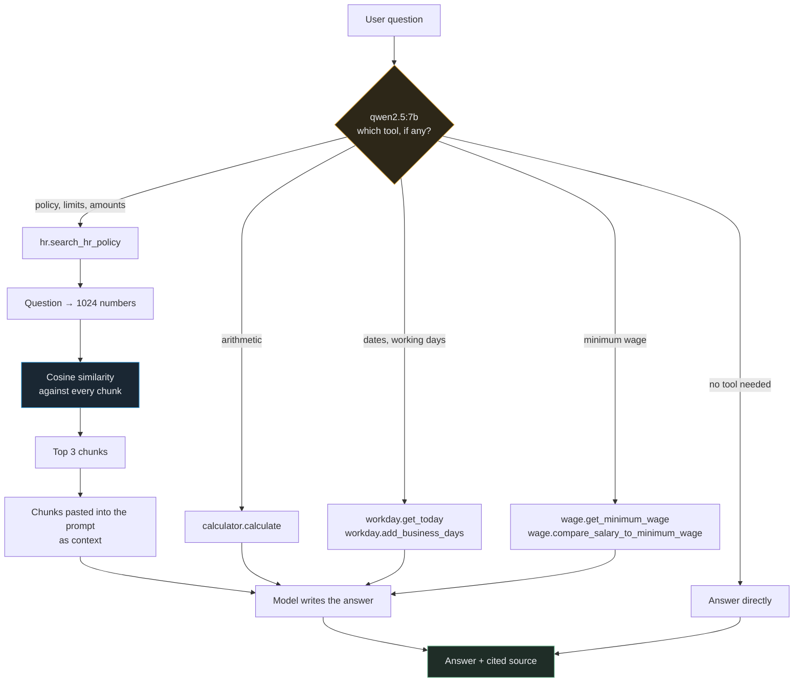
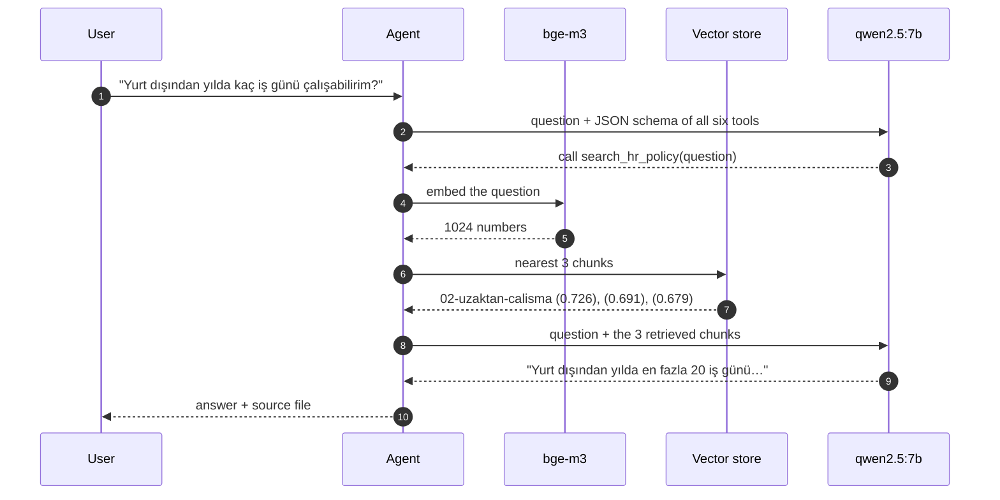
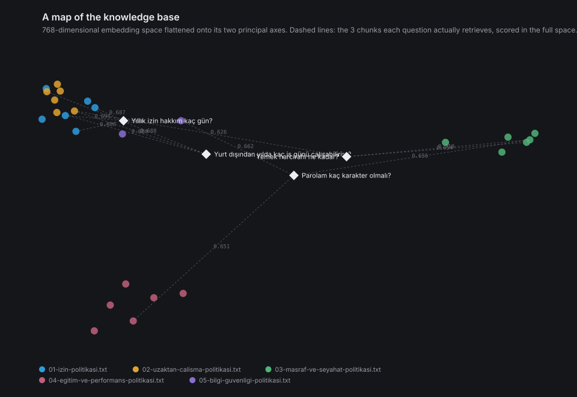

# RagAgentLab

**C# / .NET 8** ile yazılmış, tamamen **yerel bir dil modeli** üzerinde çalışan bir
**RAG (Retrieval-Augmented Generation) + araç kullanan ajan** uygulaması. API anahtarı yok,
bulut maliyeti yok, veri makineden çıkmıyor — model [Ollama](https://ollama.com) ile lokalde koşuyor.

Uygulama, kurgusal bir şirketin İK politikaları hakkındaki soruları cevaplıyor: önce klasik bir RAG
hattıyla, sonra hangi aracı çağıracağına kendisi karar veren bir ajanla.

Projenin ayırt edici yanı özellik listesi değil, **her kararın ölçümle verilmiş olması**. Hangi
embedding modelinin seçileceği, alaka eşiğinin kaç olacağı, sistem prompt'una satır eklemenin neye
mal olduğu — hepsi tahmin edilmedi, ölçüldü. Ölçümlerin tamamı repodan tek komutla tekrar üretilebilir
ve sonuçları [Mimari notlar](#architecture-notes) ile [Bilinen sınırlar](#known-limitations)
bölümlerinde, aksi çıkanlar dahil, yazılı.

```
== Stage 3 - Agent with tools ==
  Tools available to the model: search_hr_policy, calculate, get_today, add_business_days

  -> Question: Yurt dışından yılda en fazla kaç iş günü çalışabilirim?
  -> tool call #1: hr.search_hr_policy(question: "Yurt dışından yılda en fazla kaç iş günü çalışabilirim?")
  ->         result: --- source: 02-uzaktan-calisma-politikasi.txt (similarity 0,726) --- ... [66 ms]

  ANSWER
  Yurt dışından yılda en fazla 20 iş günü çalışabilirsiniz. Bu talep en az 15 gün öncesinden
  İK'ye bildirilmeli ve vergi/mevzuat değerlendirmesi için Mali İşler biriminin onayına sunulmalıdır.

  (1 tool call(s), 16,2s)

  -> Question: Aylık 750 TL internet katkısı bir yılda toplam kaç TL eder?
  -> tool call #1: calculator.calculate(expression: "750 * 12")
  ->         result: 9000 [5 ms]

  ANSWER
  Aylık 750 TL internet katkısı bir yılda toplam 9000 TL eder.

  (1 tool call(s), 5,8s)
```

Model bir soruda politika aramasını, diğerinde hesap makinesini seçti; sorulmayan izin
dokümanlarına ise hiç bakmadı. Bu kararı vermek ajanın bütün işi.

## Hızlı başlangıç

```bash
brew install ollama          # macOS; Linux ve Windows için ollama.com
ollama serve
ollama pull bge-m3           # embedding modeli (1,2 GB)
ollama pull qwen2.5:7b       # sohbet modeli (4,7 GB)

dotnet run --project src/RagAgentLab.Web       # tarayıcıda sohbet arayüzü
dotnet run --project src/RagAgentLab.Console -- agent   # konsolda ajan demosu
```

Model gerektirmeyen, anında çalışan bir demo:

```bash
dotnet run --project src/RagAgentLab.Console -- chunks   # dokümanlar nasıl parçalanıyor
```

## Bilgi tabanına doküman ekleme

Zorunlu bir format yok. Düz metin yaz, UTF-8 kaydet,
[`src/RagAgentLab.Core/data/`](src/RagAgentLab.Core/data) içine `.txt` olarak koy. Uygulama
açılışta kendisi parçalar, embed eder ve veritabanına yazar — yalnızca metni değişmiş dosyaları
yeniden işler.

Markdown, JSON, başlık etiketi veya özel bir şablon gerekmiyor. Ama **nasıl yazdığın** retrieval
kalitesini doğrudan etkiliyor, çünkü metni parçalara ayıran kod tutunacak bir yer arıyor:

**1. İlk satır başlık olsun.** Kod ilk boş olmayan satırı alıp o dosyadan üretilen **her parçanın
başına ekliyor**. Böylece tek başına getirilen bir parça bile hangi dokümandan geldiğini taşır.

**2. Bölümler arasına boş satır koy.** En kritik kural. Parçalayıcı önce boş satırlara bakar;
bulamazsa karakter sınırında, cümlenin ortasından keser.

**3. Her paragraf kendi başına anlamlı olsun.** Bir parça tek başına getirilebilir.
"Bu süre 8 haftadır" diye başlayan bir paragraf işe yaramaz — neyin sekiz haftası olduğu başka bir
parçada kalır.

**4. Bölümleri `Rag:ChunkSize` sınırının (varsayılan 600 karakter) altında tut.**

**5. Liste ve tablolarda her kaydı ayrı satıra yaz.** Parçalayıcı satır sınırına hizalanır, böylece
bir satırın etiketi değerinden kopmaz.

Aynı içeriğin iki yazımı, gerçek çıktı:

| | Boş satırsız tek blok | Başlıklı, bölümlere ayrılmış |
|---|---|---|
| 1. parça | 600 karakterde **cümle ortasından** kesildi | 430 karakter, bölüm sonunda temiz kesildi |
| 2. parça | `"eksik yakıtla teslim edilen…"` — sahipsiz | `"Yakıt giderleri…"` — bölüm başından |

### Eklendikten sonra kontrol

```bash
dotnet run --project src/RagAgentLab.Console -- chunks
dotnet run --project src/RagAgentLab.Console -- retrieve "dokümanla ilgili bir soru"
```

İlki dosyanın nasıl bölündüğünü gösterir ve model gerektirmez. İkincisi sorunun doğru parçayı
getirip getirmediğini ve benzerlik skorunu gösterir — skor `Rag:MinimumSimilarity` değerinin
(varsayılan 0,55) altındaysa o parça hiç kullanılmaz.

### Yapılandırılmış veriyi buraya koyma

Yıl→tutar tablosu, stok listesi, fiyat kataloğu gibi **satır bazlı veriler RAG'e uygun değil**.
Her satır neredeyse aynı vektörü üretir ve model komşu satırı okur; bu projede asgari ücret
tablosuyla birebir yaşandı ve ölçümü
[aşağıda](#why-a-lookup-table-does-not-belong-in-the-corpus). Böyle veriler için doğru çözüm, kesin
sonuç döndüren bir **tool** yazmaktır — örneği
[`MinimumWageTool`](src/RagAgentLab.Core/Tools/MinimumWageTool.cs).

---

> **Dokümantasyon dili:** Aşağıdaki teknik bölümler İngilizce yazıldı — kod yorumları, commit
> mesajları ve testlerle aynı dilde olsun diye. Uygulamanın kendisi ve örnek veri Türkçe.

---

---

## Contents

- [Hızlı başlangıç](#hızlı-başlangıç)
- [Bilgi tabanına doküman ekleme](#bilgi-tabanına-doküman-ekleme)
- [How it is built, in stages](#how-it-is-built-in-stages)
- [Requirements](#requirements)
- [Run](#run)
- [Configuration](#configuration)
- [Project layout](#project-layout)
- [How it works](#how-it-works)
- [Architecture notes](#architecture-notes)
- [Known limitations](#known-limitations)
- [Tests](#tests)

---

## How it is built, in stages

Each stage is a separate commit, and each one is runnable on its own.

| Stage | What it adds | Try it |
|---|---|---|
| 1 | Configuration, DI, a typed client for the model server, connectivity check | `dotnet run --project src/RagAgentLab -- connect` |
| 2 | RAG: chunking → embeddings → vector store → retrieval → grounded answer | `dotnet run --project src/RagAgentLab -- rag` |
| 3 | Agent: tool definitions, tool selection by the model, step-by-step trace | `dotnet run --project src/RagAgentLab -- agent` |
| 4 | Tests, CI, a second vector store implementation, documentation | `dotnet test` |

---

## Requirements

- .NET 8 SDK — the project also runs on a newer runtime thanks to `<RollForward>Major</RollForward>`
- Ollama running locally

```bash
brew install ollama          # macOS; see ollama.com for Linux and Windows
ollama serve                 # starts the server on http://localhost:11434
ollama pull bge-m3           # embedding model (1.2 GB)
ollama pull qwen2.5:7b       # chat model (4.7 GB) - see Known limitations for why not llama3.2
```

Docker is optional and only needed to run the Qdrant vector store:

```bash
docker compose up -d
```

## Run

```bash
dotnet run --project src/RagAgentLab -- agent     # stage 3: tool-calling agent (default)
dotnet run --project src/RagAgentLab -- rag       # stage 2: RAG pipeline
dotnet run --project src/RagAgentLab -- chunks    # chunking preview - runs without an LLM
dotnet run --project src/RagAgentLab -- connect   # stage 1: connectivity check
```

`rag` and `agent` end with an interactive prompt, so the knowledge base can be questioned freely.
`agent` also accepts a single question as an argument:

```bash
dotnet run --project src/RagAgentLab -- agent "Eğitim bütçem ne kadar?"
```

The corpus is four fictional HR policy documents in [`data/`](src/RagAgentLab.Core/data): annual and
parental leave, hybrid working, travel and expense limits, and training and performance reviews.
Nothing in them is real, and the model has never seen them — which is exactly what makes the
difference between a grounded and an ungrounded answer visible.

## Configuration

Nothing about the model, the host or the retrieval parameters is hard-coded. Everything lives in
[`appsettings.json`](src/RagAgentLab.Web/appsettings.json), bound to typed options classes and validated
at start-up:

```json
{
  "Ollama": {
    "Endpoint": "http://localhost:11434",
    "ChatModel": "qwen2.5:7b",
    "EmbeddingModel": "bge-m3",
    "TimeoutSeconds": 180,
    "Temperature": 0.2,
    "MaxOutputTokens": 800
  },
  "Rag": {
    "DataDirectory": "data",
    "ChunkSize": 600,
    "ChunkOverlap": 120,
    "TopK": 3,
    "MinimumSimilarity": 0.55,
    "EmbeddingBatchSize": 16,
    "DocumentEmbeddingPrefix": "",
    "QueryEmbeddingPrefix": "",
    "VectorStore": "InMemory"
  }
}
```

Any value can be overridden by an environment variable, e.g. `Ollama__ChatModel=llama3.1:8b` or
`Rag__VectorStore=Qdrant`.

## Project layout

```
src/RagAgentLab.Core/
├── Configuration/   typed options bound from appsettings.json
├── Ollama/          HTTP client for the model server (+ OpenAI-shaped DTOs)
├── Embeddings/      embedding service, IVectorStore, in-memory and Qdrant implementations
├── Rag/             chunking, ingestion, retrieval, the RAG pipeline
├── Shop/            the sample operational database and its queries
├── Agents/          the tool-calling agent and its trace filter
├── Tools/           tools the agent may call: policy search, calculator, workday maths
├── Demos/           one runnable demo per stage
├── Infrastructure/  DI composition root, console helpers, Ollama compatibility shim
└── data/            the fictional HR policy corpus
tests/RagAgentLab.Tests/   unit tests for the deterministic parts (no model server needed)
```

---

## How it works

### Indexing — turning documents into something searchable



A **chunk** is a slice of a document. Splitting matters because an embedding model compresses
whatever it is given into a *single* vector: feed it a whole document covering leave, remote work
and expenses and you get the blurry average of all three, which matches no question well. Small,
single-topic slices match sharply.

Each chunk then becomes 1024 numbers — its coordinates in a space where texts that mean similar
things end up near each other. Re-running the indexer only embeds chunks whose text has actually
changed; the fingerprint column is what makes that safe.

### Answering — which nodes a question passes through



The branch at the top is the whole difference between stage 2 and stage 3. In the RAG pipeline
that decision is made in code — retrieve, then generate, every time. Here the model makes it, which
is why "what is 15% of 3500?" no longer performs a pointless vector search.

### One question, traced end to end



Every step here is visible in the app: the chat shows the tool call, its arguments and its
duration, and the **"arama detayı"** panel underneath expands to the matched file, chunk index,
similarity score and the matched text.

### What a thousand dimensions actually look like



Regenerate it from the live corpus with:

```bash
dotnet run --project src/RagAgentLab.Console -- map docs/embedding-space.svg
```

Each dot is one chunk, coloured by the document it came from; the diamonds are questions and the
dashed lines go to the chunks each one retrieves. The axes are the two directions along which the
corpus varies most — a shadow of the full space, but enough to show the thing retrieval depends
on: whether documents form separate clusters, and whether a question lands near the right one.

Two details in that picture are worth knowing:

- The axes are fitted on the **corpus alone**, and the questions are then measured against them.
  Fitting on both together produced a map whose main axis was simply "question or document",
  because the embedding model marks the two with different task prefixes and puts them in
  different regions — every document collapsed into one blob.
- The lines are computed in the full 1024 dimensions, not on the flattened map. A picture that
  invented its own neighbours would be worse than no picture.

---

## Architecture notes

### Why a local model, and why Ollama

Anyone who clones this repository can run it without an API key or a bill, and the fictional HR
documents never leave the machine — which is the same reason a real company would consider a local
model for internal documents.

Ollama also exposes an **OpenAI-compatible** API under `/v1`, so the wire format here is the one a
cloud provider expects. Moving to Azure OpenAI is a change of base URL and credentials, not a change
of code.

### The two models, and what each is for

There are two models in this project doing completely different jobs, and most of the confusion
about systems like this comes from treating them as one thing.

| | `bge-m3` | `qwen2.5:7b` |
|---|---|---|
| What it does | Turns a piece of text into 1024 numbers | Reads text and writes what comes next |
| Output | A vector — coordinates, not words | Words |
| Used for | Indexing every chunk, and every question | Choosing a tool, writing the answer |
| Called | Once per chunk, once per question | Once per tool-calling round |
| Size on disk | 1.2 GB | 4.7 GB |
| Typical latency | Milliseconds | 5–30 s on CPU |
| What a failure looks like | The wrong chunk is retrieved | A wrong answer, or no tool call |

Neither of them "understands" anything. The first has been trained so that texts appearing in
similar contexts land near each other; the second has been trained to predict the next token.
Retrieval-augmented generation is the trick of using the first to put the right text in front of
the second.

**Why a separate embedding model at all.** A chat model can produce embeddings too, but they are
slower and worse at it: `qwen2.5:7b` would have to run its full 4.7 GB of weights to turn one
sentence into a vector, and its vectors are a by-product of a model trained to predict words
rather than to place texts near each other. A dedicated retrieval model does one job, and does it
in milliseconds. Indexing this corpus takes a couple of seconds; through the chat model it would
take minutes — and every question pays that cost again.

**Choosing the embedding model was a measurement, not a preference.** The project started on
`nomic-embed-text`: purpose-built for retrieval, only 274 MB, and it expects task prefixes
(`search_document:` / `search_query:`) which the code was built around. It worked — until the
corpus was Turkish.

Everything retrieval does rests on one assumption: texts meaning the same thing land near each
other. That is testable in seconds, and both models were put through the same probe:

```bash
dotnet run --project src/RagAgentLab.Console -- similarity
```

Similarity against *"How many days of annual leave do I get?"*, in both languages:

| | 🇹🇷 `nomic` | 🇹🇷 `bge-m3` | 🇬🇧 `nomic` | 🇬🇧 `bge-m3` |
|---|---|---|---|---|
| Same meaning, different words | 0.577 | **0.723** | 0.710 | 0.762 |
| Different topic, same domain | **0.649** ❌ | 0.472 | 0.615 | 0.613 |
| Unrelated (sorting a list in Python) | 0.559 ❌ | 0.389 | 0.385 | 0.351 |

In English `nomic-embed-text` is fine: the ordering is right, and it gets there without the
question and its paraphrase sharing a single content word. In Turkish the ordering *inverts* — a
question about meal allowances scores higher against an annual-leave question than that
question's own paraphrase, because the model latched onto the shared "ne kadar?" phrasing rather
than the meaning. `bge-m3` is multilingual and gets Turkish right, with a far wider spread
between the relevant and the irrelevant.

That difference shows up directly in retrieval. Best match per question, over the real corpus:

| Question | `nomic` | `bge-m3` |
|---|---|---|
| Working from abroad — **in scope** | 0.726 | 0.734 |
| Meal allowance — **in scope** | 0.716 | 0.693 |
| Training budget — **in scope** | 0.681 | 0.699 |
| Annual leave after six years — **in scope** | 0.694 | 0.632 |
| **Sorting a list in Python — out of scope** | **0.704** | 0.459 |
| Minimum wage — out of scope | 0.670 | 0.442 |
| Weather in İstanbul — out of scope | 0.665 | 0.413 |
| "What is your purpose?" — out of scope | 0.584 | 0.426 |

With `nomic-embed-text` the two groups overlap: a question about Python outscores a genuine
question about the training budget, and no cutoff can separate them. With `bge-m3` the worst
in-scope question (0.632) sits well clear of the best out-of-scope one (0.459) — a gap of 0.17,
which makes a relevance threshold a viable feature rather than a guess. `bge-m3` is therefore the
default.

**What the switch cost.** Measured on the machine this was developed on, an M-series Mac:

| | `nomic-embed-text` | `bge-m3` | Change |
|---|---|---|---|
| Download / disk | 274 MB | 1.2 GB | **4.4× larger** |
| Resident while loaded | 370 MB | 673 MB | 1.8× |
| Vector width | 768 | 1024 | +33% |
| Latency, one query | 17.8 ms | 48.0 ms | **2.7× slower** |
| Indexing the whole corpus | 3.0 s | 3.0 s | no change |
| Stored vectors, 27 chunks | 81 KB | 108 KB | +33% |

The latency looks alarming as a ratio and is irrelevant in practice: 30 ms extra per question
disappears beside the 5–30 seconds the chat model takes to answer. The indexing time is identical
because it is dominated by batching and start-up rather than by the model. What genuinely costs
something is disk and memory — roughly 300 MB more resident, which matters on a small server and
not at all on a laptop.

Set against that: retrieval went from ranges that overlap, where no threshold can work, to a gap
of 0.17 between relevant and irrelevant. For a Turkish corpus that is not a close call.

One further consequence: `bge-m3` needs **no task prefixes**, so both prefix settings are now
empty. Whether a prefix helps is a property of the model, and getting it wrong is silent —
retrieval simply gets worse — so the defaults ship matched to the default model.

**Why `qwen2.5:7b`.** The project started on `llama3.2` (3B) because small is convenient, and it
was measured failing: it wrote tool calls as prose, corrupted Turkish inside tool arguments, and
answered `750 * 1` to "750 a month, how much a year?". `qwen2.5:7b` is trained for tool use and
handles Turkish considerably better — the same four demo questions went from one correct to four.
Its own limit, measured and documented below, is that it will not chain one tool's output into
another tool's input.

Both models are configuration values, so trying a different one is a one-line change:

```json
{ "Ollama": { "ChatModel": "qwen2.5:14b", "EmbeddingModel": "bge-m3" } }
```

### Why Semantic Kernel, and how it is pointed at Ollama

Semantic Kernel provides the piece that is genuinely tedious to write by hand: the **automatic
function-calling loop**. Turning C# methods into JSON tool schemas, feeding tool results back into
the conversation, and looping until the model produces a final answer is all handled by the SDK.
Filters ([`ToolCallTraceFilter`](src/RagAgentLab.Core/Agents/ToolCallTraceFilter.cs)) then make that loop
observable, which is the same hook a production system would use for tracing, rate limiting, or an
approval gate in front of a destructive tool.

No custom connector was needed. Because Ollama speaks the OpenAI protocol, one `OpenAIClient` with a
rewritten endpoint drives both chat and embeddings:

```csharp
var openAiClient = new OpenAIClient(
    new ApiKeyCredential("ollama-does-not-check-this"),  // required by the SDK, ignored by Ollama
    new OpenAIClientOptions { Endpoint = new Uri(new Uri(options.Endpoint), "/v1") });

kernelBuilder.AddOpenAIChatCompletion(options.ChatModel, openAiClient);
kernelBuilder.AddOpenAIEmbeddingGenerator(options.EmbeddingModel, openAiClient);
```

### Why this vector store approach

`IVectorStore` is the abstraction; there are two implementations behind it and the choice is a
configuration value.

[`InMemoryVectorStore`](src/RagAgentLab.Core/Embeddings/InMemoryVectorStore.cs) scores every record on
each query — an exact, brute-force k-NN scan. For a corpus of this size that is the right answer:
a few dozen chunks are scanned in microseconds, results are exact rather than approximate, and there
is no container to run before the demo works. An ANN index only starts paying for itself in the tens
of thousands of chunks.

[`QdrantVectorStore`](src/RagAgentLab.Core/Embeddings/QdrantVectorStore.cs) is what that upgrade looks
like: an HNSW index, data that survives a restart, and chunk text carried in the point payload
because the store no longer shares the application's heap. **Nothing above the interface changed** —
not the ingestor, not the RAG pipeline, not the agent's policy tool.

The interface methods are `async` even though the in-memory implementation completes synchronously.
That is deliberate: a real store is I/O bound, and designing the signature for the eventual
implementation rather than the current one is what made the swap a one-file change.

### Two retrieval-quality fixes worth knowing about

Both were found by reading the output rather than the code, and both changed the answers measurably.

**Some embedding models are asymmetric.** `nomic-embed-text`, which this project used first, is
trained with task prefixes and expects a stored passage (`search_document:`) to be marked
differently from a query (`search_query:`); leaving them off measurably worsened its ranking.
`bge-m3`, the current default, needs no prefix at all — so whether a prefix helps is a property of
the model, and both prefixes are configuration values that ship matched to the default model.
[`IEmbeddingService`](src/RagAgentLab.Core/Embeddings/IEmbeddingService.cs) keeps *separate methods*
for documents and queries either way, so a caller cannot accidentally embed a question the way a
document is embedded — which would be a silent quality bug rather than a crash.

**An isolated chunk loses its topic.** "Employees work four days a week from the office" reads as a
general rule until you know it came from the onboarding section of the remote-work policy. Each
chunk therefore carries its document title into both the embedding and the prompt
([`DocumentChunk.ToContextualText`](src/RagAgentLab.Core/Embeddings/DocumentChunk.cs)). Before this
change the model answered "haftada 4 gün" to a question about the general office-day rule; after it,
"en az 2 gün, Salı ve Perşembe" — the correct answer.

### Chunk size is a target, not a hard cap

[`TextChunker`](src/RagAgentLab.Core/Rag/TextChunker.cs) splits on paragraph boundaries and only falls
back to a hard character cut for a paragraph that exceeds the chunk size on its own. A coherent
paragraph that overshoots slightly beats a paragraph cut in half. A chunk is also never closed while
it is still shorter than the overlap — without that rule a short document heading became a chunk of
its own and was then repeated in full at the start of the next chunk.

### Why a lookup table does not belong in the corpus

The minimum wage figures were first added to the corpus as a text document, one record per line,
and retrieved through the normal RAG path. Retrieval found the right document every time — but
every row embeds to almost the same vector, because "2014 yılı asgari ücret" and "2015 yılı asgari
ücret" differ by one token that carries no semantic weight, and the model then had to pick the
right row out of three overlapping chunks. Asked about 2015 it answered with 2014's figure.

A year-to-amount table is a lookup, and a lookup should be exact. It now sits behind
`get_minimum_wage`, beside the calculator, for the same reason: embedding similarity is the wrong
instrument for it. The same argument applies to stock levels, price lists and anything else whose
rows differ only by their values.

### Prose belongs in the corpus, facts belong behind a query

The wage table made the narrow version of this argument. The wider version is the reason the
project also carries a small e-commerce database — products, three warehouses, stock per warehouse
and four months of sales — sitting behind three tools the agent may call.

The rule that decides where something goes:

> Is the answer **written in a sentence somewhere**, or does it have to be **counted, filtered or
> computed**? Written → the corpus. Counted → a query.

An HR policy is prose: the answer exists as a passage, and finding it approximately is exactly
right. A stock level is not. It changes daily, it has to be exact, and the interesting questions
are aggregations — *"the three best sellers of the last month"* is not a passage that exists
anywhere to be found. Embedding one row per product and hoping cosine similarity picks the right
one is the wage-table mistake at a larger scale.

| Data | Where it belongs |
|---|---|
| Policies, FAQs, product descriptions, reviews, support threads, contracts | The vector store |
| Stock, prices, orders, totals, anything aggregated | A query tool |
| Semantic product search — *"yazlık, nefes alan, koyu renkli gömlek"* | The vector store, over the descriptions |

### The model chooses the question; it does not write the SQL

[`ShopTool`](src/RagAgentLab.Core/Tools/ShopTool.cs) exposes three functions — `get_stock`,
`top_selling_products` and `sales_total` — and every query behind them is hand-written and
parameterised in [`ShopQueries`](src/RagAgentLab.Core/Shop/ShopQueries.cs). The model picks which
question to ask and with what arguments. It never composes SQL.

That is a deliberate stopping point rather than a step not yet taken. Text-to-SQL, where the model
writes the query, needs a read-only connection, an allow-list of tables, a statement timeout, a row
cap and validation of whatever comes back — and then it still needs a model that can write correct
SQL. This one has been measured failing to chain two tool calls; a JOIN with a date filter is not
within reach. Parameterised tools give up flexibility and get back a blast radius of "wrong answer"
instead of "arbitrary query against the schema".

Routing, observed:

| Question | Tool chosen | Answer |
|---|---|---|
| "ELK-001 ürününden kaç adet stok var?" | `shop.get_stock` | 105 adet, three warehouses listed |
| "Son 30 günde en çok satan 3 ürün hangileri?" | `shop.top_selling_products` | Seramik Kupa Seti, Bluetooth Hoparlör, Koşu Ayakkabısı |
| "Bu ay toplam ciromuz ne kadar?" | `shop.sales_total` | 462 units, 506.518,00 TL |
| "Yurt dışından yılda kaç iş günü çalışabilirim?" | `hr.search_hr_policy` | unchanged — the corpus still answers policy questions |

Two things were measured while adding this.

**The tool count went from six to nine, and the existing questions still route correctly.** That was
the risk worth checking, given that this model's tool selection has already proved fragile; it was
checked rather than assumed.

**The date lesson repeated itself.** `top_selling_products` first required explicit dates, and asked
about "the last 30 days" the model supplied a range out of its training data and the query came back
empty — exactly what `get_minimum_wage` had done with the year. Both dates are now optional and
default to the last thirty days ending today. The tool runs on a machine with a clock; the model
does not, and asking it to discover the date through another call is asking for the one thing it
cannot reliably do.

### Pipeline or agent?

Stage 2 and stage 3 answer the same questions in two different ways, and the difference is *who
decides the order of operations*.

|  | RAG pipeline (stage 2) | Agent (stage 3) |
|---|---|---|
| Control flow | Fixed in code: retrieve, then generate | Chosen by the model, per question |
| Retrieval | Always runs | Only when the model asks for it |
| Cost | One embedding call + one completion | One completion per tool-calling round |
| Predictability | High — same steps every time | Lower — depends on the model's judgement |
| Good for | A known question shape | Open-ended questions needing different data |

The agent is not strictly better. For a task that always needs the same three steps, the
deterministic pipeline is still the better engineering choice: it is faster, cheaper and reproducible.
The agent earns its keep when the question shape is not known in advance — "what is 15% of 3500?"
does not need a vector search, and the agent is what makes that decision.

### Provider quirks are absorbed in one place

"OpenAI-compatible" does not mean identical. OpenAI deprecated `max_tokens` in favour of
`max_completion_tokens`, and the current SDK sends the new field — but Ollama only honours the old
one and silently ignores the new one. Measured directly against the endpoint:

```
max_tokens             -> completion_tokens=20,  finish_reason=length
max_completion_tokens  -> completion_tokens=457, finish_reason=stop
```

So the configured output limit did nothing, and a model that started rambling — a common failure
mode for small models during tool calling — generated until the request timed out.
[`OllamaCompatibilityHandler`](src/RagAgentLab.Core/Infrastructure/OllamaCompatibilityHandler.cs) renames
the field on the way out, in the one place such quirks belong, so the rest of the code keeps using
the standard SDK.

---

## Known limitations

Everything here was measured against this project, not assumed. All of it is a property of the
model: the pipeline, the tool registration and the trace are identical whichever model runs.

### `llama3.2` (3B) is not usable as an agent in Turkish

It is fine for stage 2, where the code decides what happens and the model only has to read the
retrieved context and answer. In stage 3, where it must choose tools and emit JSON arguments, it
failed on three of four demo questions:

- it wrote the tool call as plain text instead of emitting a real tool call, so no tool ran —
  and then degenerated into repetition:
  `{"name":"hr-search_hr_policy","parameters":{"question":"Yurt şĶşiınden yılda en fazla şekilık şarkışĶşi şekilık ...`
- it corrupted Turkish inside tool arguments (`"Yurt dışından"` → `"Yurt şĶdinden"`), which then
  retrieved the wrong passage;
- it answered `750 * 1` for "750 TL per month, how much per year?".

The default configuration therefore uses `qwen2.5:7b`. Switching is one line:

```json
{ "Ollama": { "ChatModel": "llama3.1:8b" } }
```

### `qwen2.5:7b` does not chain tools

It picks the right single tool reliably, copies Turkish arguments verbatim, and gets the
arithmetic right. What it does not do is use one tool's output as another tool's input — it calls
one tool and invents the other value:

| Question | What it did | Correct answer |
|---|---|---|
| "Talebi en geç hangi tarihte girmem gerekir?" | called `add_business_days(-5)` without looking the rule up | the policy says 10 working days |
| "Bugünden 10 iş günü sonrası?" | called `add_business_days` with a made-up "today" of `2023-04-05` | should have called `get_today` first |

Moving the guidance into the tool's own schema description did not fix it. This is the honest
boundary of a 7B model on a laptop, and it is why the scripted demo questions each need one tool.
A multi-step plan needs either a larger model or an explicitly orchestrated chain — at which point
the deterministic pipeline of stage 2 is the better tool for the job.

### A relevance threshold depends entirely on the embedding model

The obvious way to stop an out-of-scope question dragging irrelevant passages into the prompt is
to ignore matches below some similarity. On `nomic-embed-text` that turned out to be impossible:
an out-of-scope question about Python scored 0.704 while a genuine question about the training
budget scored 0.681, so a cutoff at 0.70 would have admitted the wrong one and rejected the right
one. The measurement is [above](#the-two-models-and-what-each-is-for).

On `bge-m3` the same eight questions separate cleanly — 0.632 at worst in scope against 0.459 at
best out of scope. A threshold somewhere around 0.55 would now work.

`Rag:MinimumSimilarity` now applies that floor, defaulting to 0.55 — matches below it are dropped
and the policy tool reports that the documents do not cover the question, instead of handing the
model three passages about something else. Setting it to 0 restores the old behaviour.

The number is worth treating with suspicion, and the code says so: it belongs to *this* embedding
model against *this* corpus. A threshold is not a property of RAG that can be looked up. On one
model it was impossible to choose; on another it is straightforward; on a third corpus it will be
a different number. Re-measure with the `retrieve` console mode whenever either changes.

### Prompt length is not a free parameter

Adding a single four-line rule to the agent's system prompt made `qwen2.5:7b` stop calling tools
altogether on one question. Measured directly against the endpoint with everything else identical:

```
system prompt without the extra rule  -> finish_reason=tool_calls, tool_calls=[workday-get_today]
system prompt with the extra rule     -> finish_reason=stop,       tool_calls=null, content=""
```

Guidance about a specific tool therefore lives in that tool's description, which is part of the
schema, rather than being piled into the system prompt.

### An empty completion is a real outcome

Both models occasionally return an empty message with no tool call and `finish_reason: "stop"`,
particularly for compound questions. The agent names that dead end explicitly instead of returning
a blank string that would read as a bug in the application.

### Other limits

**Ingestion runs at start-up.** The in-memory store is rebuilt on every run — a second or two for
this corpus, unacceptable for a real one. With `Rag:VectorStore` set to `Qdrant` the index
persists and ingestion becomes a separate job.

**The Qdrant implementation is compiled and wired but has not been run against a live server** —
no Docker daemon was available on the machine this was developed on. The container definition is
in [`docker-compose.yml`](docker-compose.yml).

**Retrieval is single-shot.** No re-ranking, no query rewriting, no hybrid keyword search. Those
are the obvious next steps if answer quality mattered more than legibility here.

## Tests

```bash
dotnet test
```

The suite covers the deterministic parts of the system — the chunker, cosine similarity, the vector
store, the expression parser and the agent's tools — so it needs no model server and runs in CI.
The parts that do need a model are exercised by the demos instead.
